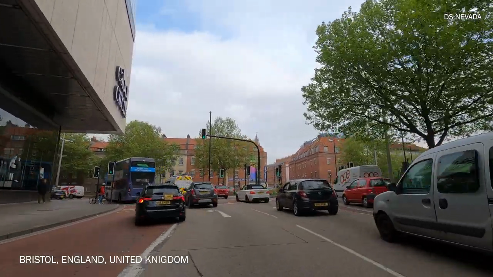
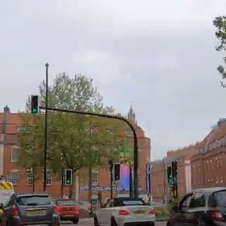

# image-cropping-python - Transformation Block - Batch Crop and Save Images

This Transformation block allows you to batch crop multiple images in a folder to a specified size and save the cropped versions to a new folder. The script is designed to be used in a Jupyter Notebook and provides a visual preview of the first few cropped images. This is useful for image preprocessing tasks like dataset preparation, image resizing for thumbnails, and other image manipulation tasks.

## Features
- Batch processing of images from a folder.
- Crops images to a user-defined size.
- Saves the cropped images in a specified output folder.
- Displays a preview of the first few cropped images for quick verification.
  
## Requirements

Before running the notebook, make sure you have the following libraries installed:

- `Pillow` (for image manipulation)
- `matplotlib` (for displaying the cropped image samples)

You can install the necessary libraries using pip:

```bash
pip install pillow matplotlib
```

## Usage in Jupyter notebook

### 1. Clone or download the repository
```bash
git clone git@github.com:moe-sani/image-cropping-python.git
cd image-cropper
```

### 2. Open the Jupyter Notebook
Open the provided Jupyter Notebook (`Image_Cropper.ipynb`) in your local environment.

### 3. Set Parameters
In the notebook, you'll need to set the following parameters:
- **`input_folder`**: Path to the folder containing the images you want to crop.
- **`output_folder`**: Path to the folder where cropped images will be saved.
- **`crop_size`**: Tuple specifying the size of the crop in `(width, height)` format.

For example:
```python
input_folder = 'path/to/your/input/folder'
output_folder = 'path/to/your/output/folder'
crop_size = (300, 300)
```

### 4. Run the Notebook
Execute the notebook cells. The script will:
1. Load images from the input folder.
2. Crop them to the specified size (centered).
3. Save the cropped images to the output folder.
4. Display the first few cropped images as a sample.

## Usage as a Python Script
Run this script from the command line, specifying the crop width and height separately:

```bash
python transform.py --in-directory path/to/input_folder --out-directory path/to/output_folder --crop-width 300 --crop-height 300
```

Arguments

* `--crop-width`: The desired width for cropping.
* `--crop-height`: The desired height for cropping.
* `--in-directory`: Path to the folder containing the images to crop.
* `--out-directory`: Path to the folder where cropped images will be saved.

#### Notes
* Images smaller than the specified crop-width or crop-height are skipped, and a message is printed for each skipped image.
* The output directory is created if it doesn’t already exist.

### Usage as a Transformation Block in Edge Impulse

This folder has been built to be compatible with Edge Impulse Transfomation block. Simply push this to your project:
```bash
edge-impulse-blocks init
edge-impulse-blocks push
```
For more information about how to configure transformation blocks, refer to [Edge Impulse Transformation blocks](https://docs.edgeimpulse.com/docs/edge-impulse-studio/organizations/custom-blocks/transformation-blocks)

### Cropped Status Tracking
The crop_image function returns True if the image was cropped and False if it was skipped (i.e., the image is smaller than the crop size).
After processing, the script generates an info.labels JSON file in the output directory with metadata for each processed image.
The "path" is set to the image filename. "Cropped" in metadata is set to "Yes" if the image was cropped and "No" if it was saved without cropping.

```json
{
    "version": 1,
    "files": [
        {
            "path": "road100.png",
            "category": "split",
            "label": { "type": "unlabeled" },
            "metadata": {
                "Cropped": "Yes"
            }
        },
        {
            "path": "road101.png",
            "category": "split",
            "label": { "type": "unlabeled" },
            "metadata": {
                "Cropped": "No"
            }
        }
    ]
}

```

### Viewing Output
The output folder will contain all the cropped images. In addition, the notebook will display the first few cropped images in a matplotlib plot.
Here is an example:

Original:



Cropped:



## License

This project is licensed under the MIT License. See the [LICENSE](LICENSE) file for details.